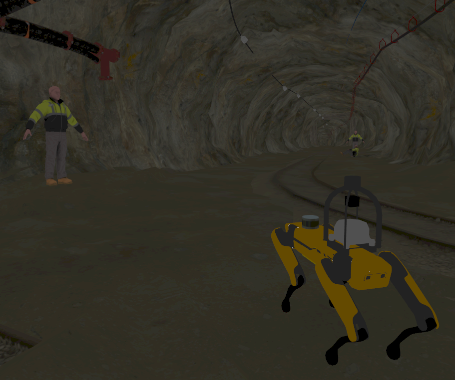

# spot_gazebo

A ROS 2 Humble simulation package for the Boston Dynamics Spot robot using Ignition/Gazebo Sim (the successor to Gazebo Classic). This package provides:

- Full URDF/SDF robot description for simulation
- Integration with CHAMP quadruped controller
- Launch files for easy simulation setup
- Gazebo world configurations
- ROS 2/Gazebo bridge configuration for sensor and control interfaces

<div style="display: flex; gap: 10px;">
    
    
    
</div>

<!--  -->

## Included packages

* `champ` - Core CHAMP quadruped controller integration package adapted for ROS 2 Humble and Spot
* `champ_base` - Base implementation of quadruped controller with gait generators and kinematics
* `champ_config` - Configuration package containing robot-specific parameters and settings for the CHAMP quadruped controller
* `champ_msgs` - Custom ROS 2 message definitions for quadruped control and state information
* `spot_bringup` - Launch files and configuration to start Spot simulation with all required nodes
* `spot_description` - URDF and SDF robot description files defining Spot's model for ROS 2 and Gazebo
* `spot_gazebo` - Ignition Gazebo simulation specific files including worlds and simulation plugins
    * Edgar Mine

        


## Install

### Requirements

- Ubuntu 22.04
- [ROS 2 humble](https://docs.ros.org/en/humble/Installation.html) 
- [Gazebo Fortress](https://gazebosim.org/docs/fortress/install/)

## Usage

1. Install dependencies
    ```bash
    cd ~/ros2_ws
    source /opt/ros/humble/setup.bash
    sudo rosdep init
    rosdep update
    rosdep install --from-paths src --ignore-src -r -i -y --rosdistro humble
    ```
2. Build the project
    ```bash
    colcon build --cmake-args -DBUILD_TESTING=ON
    ```
3. Source the workspace
    ```bash
    source ~/ros2_ws/install/setup.sh
    ```
4. Launch the simulation
    ```bash
    ros2 launch spot2_bringup spot.gazebo.launch.py
    ```
## Acknowledgement
* [champ](https://github.com/chvmp/champ/tree/ros2) ros2 branch.
* [spot_config](https://github.com/chvmp/robots/tree/master/configs/spot_config) with some modification.
* [spot_description](https://github.com/clearpathrobotics/spot_ros) for URDF.
